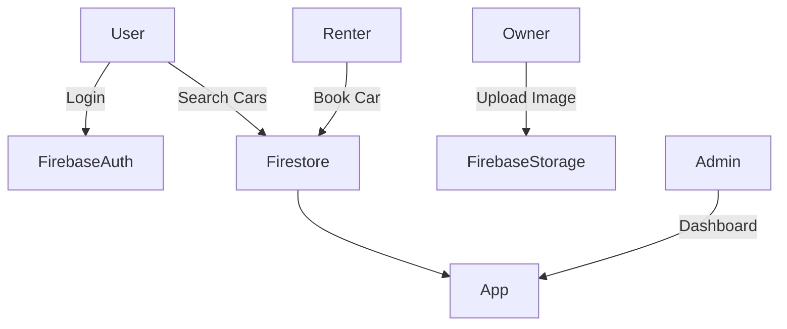

# RentroCar - Car Rental App 🚗

A no-code mobile app that allows users to list and rent cars with search, booking, and notifications features. Built with **FlutterFlow**, integrated with Firebase.

Full Documentation: [Portfolio](https://docs.google.com/document/d/e/2PACX-1vREdMXU2bRBreRkaeI1N9bCQ_O1bFa1p3mnkDkcBbf05qT6KcdjtoXp7IasOSzI9g/pub)
---

## ⚙️ Tech Stack

- **FlutterFlow** – UI builder & logic configuration (No-code)
- **Firebase Firestore** – Cloud database for real-time data
- **Firebase Auth** – User authentication (email/password)
- **Firebase Storage** – For images (e.g., car photos)
- **FlutterFlow Actions** – For logic like booking flow, conditional visibility, etc.

---

## 🧱 Architecture Overview

----

## 🗂️ Project Structure

FlutterFlow handles project structure visually, but here’s a logic breakdown:

- **Screens**  
  - `SignUp / Login`: Auth flow using Firebase  
  - `Home`: Display cars with filters  
  - `AddCar`: Upload car details and images  
  - `BookingSummary`: Show booking details  
  - `MyCars`: Owner can view & manage their cars  
  - `Notifications`: Firebase-triggered alerts  
  - `Profile`: User info & app settings

- **Collections** (Firestore)
  - `users`: name, email, role (owner/renter), points  
  - `cars`: model, price, image, ownerId, availability  
  - `bookings`: carId, userId, startDate, status  
  - `notifications`: title, userId, timestamp

- **Actions & Logic**
  - Firebase Auth + Page Redirect
  - Visibility conditions (e.g., only show bookings for current user)
  - Point system: user earns/uses points (stored as int)
